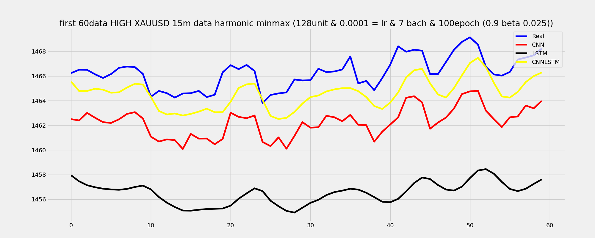

# Gold Price Prediction with Deep Learning (CNN, LSTM, CNN-LSTM)

Project (Computer Science, University of Tabriz) on forecasting the
price of gold (XAU/USD) using deep learning. Three architectures — a 1D CNN, an
LSTM, and a hybrid CNN-LSTM — are built, trained, and compared on 15-minute
XAU/USD price data.

## Overview

Gold prices are influenced by many factors (supply and demand, interest rates,
inflation, global economic conditions), which makes them a good candidate for
sequence-modeling approaches. This project:

1. Loads and cleans historical 15-minute XAU/USD OHLC data.
2. Splits the data into training, validation, and test sets.
3. Normalizes the data using a min-max scaling based on the harmonic mean of
   the OHLC average.
4. Builds sliding-window sequences (time step = 4) for supervised learning.
5. Defines and trains three models:
   - **CNN** — a 1D convolutional network for feature extraction.
   - **LSTM** — a recurrent network for learning temporal dependencies.
   - **CNN-LSTM** — a hybrid model combining convolutional feature extraction
     with LSTM sequence learning.
6. Evaluates and compares the models by inverse-transforming predictions back
   to the original price scale and plotting them against real values.

**Result:** the hybrid **CNN-LSTM** model gave the best overall performance,
followed by LSTM and CNN, at the cost of longer training time and higher
complexity.

## Repository structure

```
.
├── Normal_CNN_and_LSTM_XAUUSD.ipynb   # Main notebook: data prep, models, training, evaluation
├── README.md
├── requirements.txt
├── data/
│   └── XAUUSD_M15_201703100100_202106291215.csv   # Raw 15-minute XAU/USD OHLC data
├── models/
│   ├── modelCNN_h_maxxmin15m.h5                   # Trained CNN model
│   ├── modelLSTM_h_maxxmin15m.h5                  # Trained LSTM model
│   └── modelCNNLSTM_h_maxxmin15m.h5               # Trained CNN-LSTM model
└── results/
    ├── loss/                                      # Per-epoch training / validation loss (MSE)
    │   ├── histCNN_h_maxxmin15m.txt
    │   ├── histLSTM_h_maxxmin15m.txt
    │   ├── histCNNLSTM_h_maxxmin15m.txt
    │   ├── val_losshistCNN_h_maxxmin15m.txt
    │   ├── val_losshistLSTM_h_maxxmin15m.txt
    │   └── val_losshistCNNLSTM_h_maxxmin15m.txt
    └── plots/
        └── prediction_comparison_first60.png      # Real vs. CNN vs. LSTM vs. CNN-LSTM predictions
```

## Data

- **Instrument:** XAU/USD (Gold vs. US Dollar)
- **Timeframe:** 15-minute candles
- **Fields used:** Date/Time, Open, High, Low, Close
- **File:** [`data/XAUUSD_M15_201703100100_202106291215.csv`](data/XAUUSD_M15_201703100100_202106291215.csv)

To reproduce the results, update the file path in the notebook's data-loading
cell to point to `data/XAUUSD_M15_201703100100_202106291215.csv` (the
notebook currently references a local Windows path from development).

## Models

| Model | Layers | Saved weights |
|---|---|---|
| CNN | `Conv1D` → `Flatten` → `Dense` | `models/modelCNN_h_maxxmin15m.h5` |
| LSTM | `LSTM` → `Dense` | `models/modelLSTM_h_maxxmin15m.h5` |
| CNN-LSTM | `Conv1D` → `LSTM` → `Dense` | `models/modelCNNLSTM_h_maxxmin15m.h5` |

Common hyperparameters: 128 units, kernel size 2, batch size 7, 50 epochs,
learning rate 0.0001, loss = MSE, optimizers = Adam / SGD / RMSprop.

Pretrained weights are included in `models/` so you can load and use the
models directly without retraining:

```python
from keras.models import load_model
model = load_model("models/modelCNNLSTM_h_maxxmin15m.h5", compile=False)
```

## Results

Training and validation loss per epoch for each model are logged in
`results/loss/`. The plot below compares real prices against each model's
predictions on the first 60 points of the test set:



The CNN-LSTM model (yellow) tracks the real price (blue) most closely,
followed by the CNN (red); the plain LSTM (black) underfits the price level
in this run.

## Getting started

```bash
git clone https://github.com/sanfand/Gold_Price_Prediction_Deep_Learning.git
cd Gold_Price_Prediction_Deep_Learning
pip install -r requirements.txt
jupyter notebook Normal_CNN_and_LSTM_XAUUSD.ipynb
```

